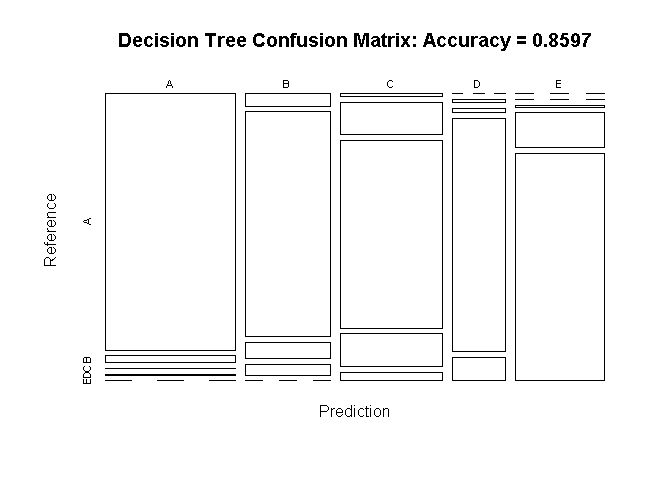
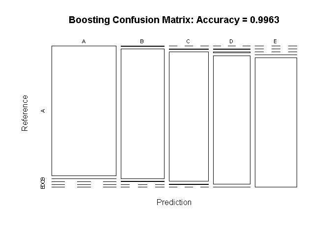
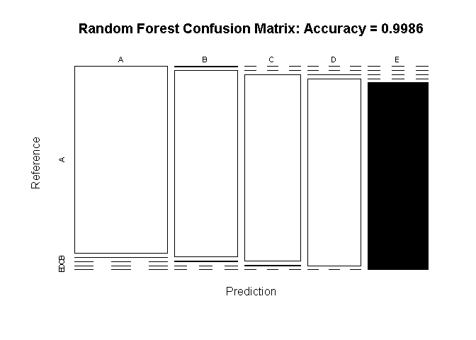

# Excercise quality estimation
Miguel A. Regueira  
May 11, 2016  


## Executive summary

In this project it is expected to estimate the quality of the exercises realized by means of different sensors.

## Data loading & cleaning

Load the raw data stored in folder './data', take care of different #NA formats to properly get them, remove the first column that contains the row number and set a seed for reproducible purpose:

```r
training <- read.csv(file = "./data/pml-training.csv", na.strings=c("NA","#DIV/0!",""))
testing <- read.csv(file = "./data/pml-testing.csv", na.strings=c("NA","#DIV/0!",""))
training<-training[,2:ncol(training)]
testing<-testing[,2:ncol(testing)]
set.seed(20160511)
dim(training); dim(testing)
```

```
## [1] 19622   159
```

```
## [1]  20 159
```

Some columns has zero variability or pretty close to it, which won't help to predict any output from there, so let's remove them:

```r
nzv <- nearZeroVar(training, saveMetrics=TRUE)
training <- training[,nzv$nzv==FALSE]
testing <- testing[,nzv$nzv==FALSE]
dim(training); dim(testing)
```

```
## [1] 19622   123
```

```
## [1]  20 123
```

```r
rm(nzv)
```

Still, some columns are not providing meaningful information. We can remove columns that mostly contains NA values, for example, let's remove those columns with more than 90% of NA values:

```r
nrow <- nrow(training)
na <- sapply(training,function(x)sum(is.na(x))/nrow>0.9)
training <- training[,!na]
testing <- testing[,!na]
dim(training); dim(testing)
```

```
## [1] 19622    58
```

```
## [1] 20 58
```

```r
rm(na); rm(nrow)
```

Now let's convert all numeric columns to float:

```r
indx <- sapply(testing, is.integer)
testing[indx] <- lapply(testing[indx], function(x) as.numeric(x))
indx <- sapply(training, is.integer)
training[indx] <- lapply(training[indx], function(x) as.numeric(x))
testing <- testing[,-58]
testing <- rbind(training[1, -58] , testing)
testing <- testing[-1,]
rm(indx)
```


Now let's split the training dataset in training and testing data, let's call them myTraining and myTesting:

```r
inTrain <- createDataPartition(y=training$classe, p=0.6, list=FALSE)
myTraining <- training[inTrain, ]; myTesting <- training[-inTrain, ]
dim(myTraining); dim(myTesting)
```

```
## [1] 11776    58
```

```
## [1] 7846   58
```

```r
rm(inTrain)
```

## Model building

Let's build 3 different models and compared them:

1. Decision tree
2. Boosting
3. Random Forest

In the following sections the process is the same, build the expected model, predict the testing samples and build the confusion matrix.

### Decision tree


```r
modFit1 <- rpart(classe ~ ., data=myTraining, method="class")
predictions1 <- predict(modFit1, myTesting, type = "class")
cm1 <- confusionMatrix(predictions1, myTesting$classe)
```


### Boosting


```r
fitControl <- trainControl(method='cv', number = 3)
modFit2 <- train(classe ~ ., data=myTraining, method="gbm", trControl=fitControl, verbose=FALSE)
```

```
## Loading required package: gbm
```

```
## Warning: package 'gbm' was built under R version 3.2.5
```

```
## Loading required package: survival
```

```
## 
## Attaching package: 'survival'
```

```
## The following object is masked from 'package:caret':
## 
##     cluster
```

```
## Loading required package: splines
```

```
## Loading required package: parallel
```

```
## Loaded gbm 2.1.1
```

```
## Loading required package: plyr
```

```r
predictions2 <- predict(modFit2, myTesting)
cm2 <- confusionMatrix(predictions2, myTesting$classe)
```

### Random forest


```r
modFit3 <- randomForest(classe ~ ., data=myTraining)
prediction3 <- predict(modFit3, myTesting, type = "class")
cm3 <- confusionMatrix(prediction3, myTesting$classe)
```

## Model selection

In the following figure it can be observed the result of the confusion matrix of the models previously build. It can be observed that random forest provide a very good accuracy, so this is the model it will be used to predict the test samples.


```r
plot(cm1$table, col = cm1$byClass, main = paste("Decision Tree Confusion Matrix: Accuracy =", round(cm1$overall['Accuracy'], 4)))
```

<!-- -->

```r
plot(cm2$table, col = cm2$byClass, main = paste("Boosting Confusion Matrix: Accuracy =", round(cm2$overall['Accuracy'], 4)))
```

<!-- -->

```r
plot(cm3$table, col = cm3$byClass, main = paste("Random Forest Confusion Matrix: Accuracy =", round(cm3$overall['Accuracy'], 4)))
```

<!-- -->

```r
cm3
```

```
## Confusion Matrix and Statistics
## 
##           Reference
## Prediction    A    B    C    D    E
##          A 2231    1    0    0    0
##          B    1 1517    5    0    0
##          C    0    0 1362    3    0
##          D    0    0    1 1283    0
##          E    0    0    0    0 1442
## 
## Overall Statistics
##                                           
##                Accuracy : 0.9986          
##                  95% CI : (0.9975, 0.9993)
##     No Information Rate : 0.2845          
##     P-Value [Acc > NIR] : < 2.2e-16       
##                                           
##                   Kappa : 0.9982          
##  Mcnemar's Test P-Value : NA              
## 
## Statistics by Class:
## 
##                      Class: A Class: B Class: C Class: D Class: E
## Sensitivity            0.9996   0.9993   0.9956   0.9977   1.0000
## Specificity            0.9998   0.9991   0.9995   0.9998   1.0000
## Pos Pred Value         0.9996   0.9961   0.9978   0.9992   1.0000
## Neg Pred Value         0.9998   0.9998   0.9991   0.9995   1.0000
## Prevalence             0.2845   0.1935   0.1744   0.1639   0.1838
## Detection Rate         0.2843   0.1933   0.1736   0.1635   0.1838
## Detection Prevalence   0.2845   0.1941   0.1740   0.1637   0.1838
## Balanced Accuracy      0.9997   0.9992   0.9976   0.9988   1.0000
```

## Predicting test samples

Now we are ready to predict the class of the test samples using the selected model, random forest:


```r
prediction <- predict(modFit3, testing, type = "class")
prediction <- data.frame(problem_id = seq(1:20),prediction = prediction)
prediction
```

```
##    problem_id prediction
## 2           1          B
## 3           2          A
## 4           3          B
## 5           4          A
## 6           5          A
## 7           6          E
## 8           7          D
## 9           8          B
## 10          9          A
## 11         10          A
## 12         11          B
## 13         12          C
## 14         13          B
## 15         14          A
## 16         15          E
## 17         16          E
## 18         17          A
## 19         18          B
## 20         19          B
## 21         20          B
```

## R and package versions used

Some information about the packages used, their versions, the R version, environment, etc.


```r
library(devtools)
```

```
## Warning: package 'devtools' was built under R version 3.2.5
```

```r
devtools::session_info()
```

```
## Session info --------------------------------------------------------------
```

```
##  setting  value                       
##  version  R version 3.2.3 (2015-12-10)
##  system   x86_64, mingw32             
##  ui       RTerm                       
##  language (EN)                        
##  collate  English_United States.1252  
##  tz       Europe/Paris                
##  date     2016-05-13
```

```
## Packages ------------------------------------------------------------------
```

```
##  package      * version date       source        
##  car            2.1-2   2016-03-25 CRAN (R 3.2.3)
##  caret        * 6.0-68  2016-04-11 CRAN (R 3.2.5)
##  class          7.3-14  2015-08-30 CRAN (R 3.2.3)
##  codetools      0.2-14  2015-07-15 CRAN (R 3.2.3)
##  colorspace     1.2-6   2015-03-11 CRAN (R 3.2.3)
##  devtools     * 1.11.1  2016-04-21 CRAN (R 3.2.5)
##  digest         0.6.9   2016-01-08 CRAN (R 3.2.3)
##  e1071          1.6-7   2015-08-05 CRAN (R 3.2.5)
##  evaluate       0.9     2016-04-29 CRAN (R 3.2.5)
##  foreach        1.4.3   2015-10-13 CRAN (R 3.2.5)
##  formatR        1.4     2016-05-09 CRAN (R 3.2.3)
##  gbm          * 2.1.1   2015-03-11 CRAN (R 3.2.5)
##  ggplot2      * 2.1.0   2016-03-01 CRAN (R 3.2.4)
##  gtable         0.2.0   2016-02-26 CRAN (R 3.2.4)
##  htmltools      0.3.5   2016-03-21 CRAN (R 3.2.4)
##  iterators      1.0.8   2015-10-13 CRAN (R 3.2.3)
##  knitr        * 1.13    2016-05-09 CRAN (R 3.2.3)
##  lattice      * 0.20-33 2015-07-14 CRAN (R 3.2.3)
##  lme4           1.1-12  2016-04-16 CRAN (R 3.2.5)
##  magrittr       1.5     2014-11-22 CRAN (R 3.2.3)
##  MASS           7.3-45  2015-11-10 CRAN (R 3.2.3)
##  Matrix         1.2-3   2015-11-28 CRAN (R 3.2.3)
##  MatrixModels   0.4-1   2015-08-22 CRAN (R 3.2.4)
##  memoise        1.0.0   2016-01-29 CRAN (R 3.2.3)
##  mgcv           1.8-9   2015-10-30 CRAN (R 3.2.3)
##  minqa          1.2.4   2014-10-09 CRAN (R 3.2.4)
##  munsell        0.4.3   2016-02-13 CRAN (R 3.2.3)
##  nlme           3.1-127 2016-04-16 CRAN (R 3.2.5)
##  nloptr         1.0.4   2014-08-04 CRAN (R 3.2.4)
##  nnet           7.3-11  2015-08-30 CRAN (R 3.2.3)
##  pbkrtest       0.4-6   2016-01-27 CRAN (R 3.2.4)
##  plyr         * 1.8.3   2015-06-12 CRAN (R 3.2.3)
##  quantreg       5.21    2016-02-13 CRAN (R 3.2.4)
##  randomForest * 4.6-12  2015-10-07 CRAN (R 3.2.5)
##  rattle       * 4.1.0   2016-01-26 CRAN (R 3.2.5)
##  RColorBrewer * 1.1-2   2014-12-07 CRAN (R 3.2.3)
##  Rcpp           0.12.4  2016-03-26 CRAN (R 3.2.4)
##  reshape2       1.4.1   2014-12-06 CRAN (R 3.2.3)
##  RGtk2          2.20.31 2014-07-19 CRAN (R 3.2.3)
##  rmarkdown      0.9.6   2016-05-01 CRAN (R 3.2.5)
##  rpart        * 4.1-10  2015-06-29 CRAN (R 3.2.3)
##  rpart.plot   * 1.5.3   2015-10-01 CRAN (R 3.2.5)
##  scales         0.4.0   2016-02-26 CRAN (R 3.2.4)
##  SparseM        1.7     2015-08-15 CRAN (R 3.2.3)
##  stringi        1.0-1   2015-10-22 CRAN (R 3.2.3)
##  stringr        1.0.0   2015-04-30 CRAN (R 3.2.3)
##  survival     * 2.38-3  2015-07-02 CRAN (R 3.2.3)
##  withr          1.0.1   2016-02-04 CRAN (R 3.2.3)
##  yaml           2.1.13  2014-06-12 CRAN (R 3.2.3)
```
